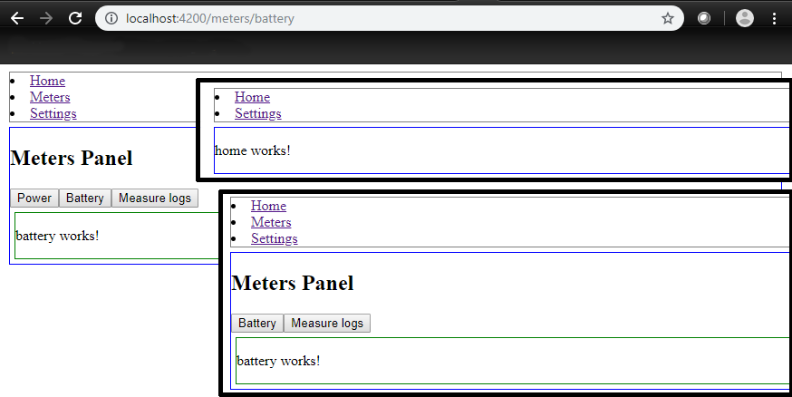

This sample in Angular permits to find a way to configure the Web routing at build process.
It will exclude codes from unused Web pages by replacing Angular router module files.

# Routing

This project was generated with [Angular CLI](https://github.com/angular/angular-cli) version 7.0.3.

## Development server

Run `ng serve` for a dev server. Navigate to `http://localhost:4200/`. The app will automatically reload if you change any of the source files.
### Excluding Meters Web page
Run `ng serve --configuration=noMeters` for a dev server. Navigate to `http://localhost:4200/`. The app will automatically reload if you change any of the source files.

### Excluding Meters/Power Web page
Run `ng serve --configuration=noMetersPower` for a dev server. Navigate to `http://localhost:4200/`. The app will automatically reload if you change any of the source files.

## Code scaffolding

Run `ng generate component component-name` to generate a new component. You can also use `ng generate directive|pipe|service|class|guard|interface|enum|module`.

## Build

Run `ng build` to build the project. The build artifacts will be stored in the `dist/` directory. Use the `--prod` flag for a production build.

### Excluding Meters Web page
Run `ng build --configuration=noMeters` to build the project without the 'Meters' Web pages. The build artifacts will be stored in the `dist/` directory. No '--prod' flag available yet for this specific production build.

### Excluding Meters/Power Web page
Run `ng build --configuration=noMetersPower` to build the project without the 'Power' Web page basically accessible through the 'Meters Web page. The build artifacts will be stored in the `dist/` directory. No '--prod' flag available yet for this specific production build.

### Excluding Meters/Power Web page

## Running unit tests

Run `ng test` to execute the unit tests via [Karma](https://karma-runner.github.io).

## Running end-to-end tests

Run `ng e2e` to execute the end-to-end tests via [Protractor](http://www.protractortest.org/).

## Further help

To get more help on the Angular CLI use `ng help` or go check out the [Angular CLI README](https://github.com/angular/angular-cli/blob/master/README.md).
